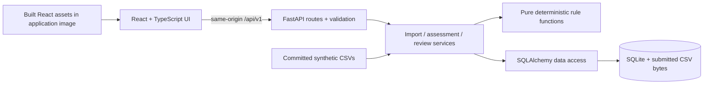

# SAT-SA / NIGRANI-SA — MVP Implementation Plan

Status: the MVP described here has been implemented. See the README for current commands and `docs/verification.md` for measured checks.

This document records the MVP scope, technical decisions, and original acceptance targets. The existing `SIH26157_SAT-SA_Implementation_Plan_and_PPT.md` remains the broader product and presentation reference. Use the README and verification notes for the implemented behavior and measured results.

## 1. Project Overview

**Product:** NIGRANI-SA, a Supervisory Analytics Tool for SOC Assessment (SAT-SA).

**Purpose:** help a supervisor assess how a Critical Sector Entity's security operations function using submitted alert and case records as operational evidence. The useful output is a set of explainable observations about processes and evidence coverage, with records a human can inspect.

**Primary user:** one supervisor evaluating periodic submissions from several entities on a local workstation. An evaluator should understand the product and complete a meaningful review in three minutes.

### Repository and source analysis

At the planning baseline, the repository contained:

| File / state | Finding | Consequence for this plan |
|---|---|---|
| `problem_Statement.txt` | Describes NCIIPC's manual supervisory reviews, but ends at “capabilities relating to:”. The capability list and remaining requirements are missing. | Treat the supplied background as confirmed. Treat additional requirements from the old plan as provisional until the complete statement is available. |
| `SIH26157_SAT-SA_Implementation_Plan_and_PPT.md` | Broad plan covering ingestion, 21 indicators, peer baselines, ML, scoring, review packs, offline deployment, and presentation content. | Preserve its evidence-first approach, explainability, human review, and offline direction; substantially reduce the first release. |
| `README.md` | Project title only. | No setup, architecture, or existing implementation needs to be preserved. |
| Application / infrastructure | No application source, manifests, tests, or deployment files found. No applicable `AGENTS.md` found. | Start a small monorepo; there is no existing technology commitment. |
| Git | One existing commit, `ce3aebb` (`first commit`); source statement and broader plan are untracked. | Preserve the current history and source files. Stage only deliberately reviewed paths during later implementation. |

There was no file named `implementation-plan.md`; this document creates it. The official SIH problem portal linked by the old plan could not be retrieved during this review, and an official-domain search did not recover the full statement. Consequently, this plan does not assert that the old plan's FR/DEP identifiers, eight capability names, competition dates, or submission rules have been independently verified.

### Gaps and changes to the earlier plan

| Earlier direction or gap | MVP decision and reason |
|---|---|
| Six initial indicators, then 21 indicators plus ML | Three deterministic checks within one assessment feature. Each has exact semantics, evidence, and boundary tests. |
| Streamlit first, React later | React from the first UI milestone; avoid rebuilding the evaluator experience. |
| DuckDB plus PostgreSQL, workers, API, and separate UI service | One FastAPI process serving a React build, with SQLite on a persistent volume. This fits bounded submissions and one operator. |
| CSV, JSON, database dumps, APIs, configurable mapping | Three documented CSV templates. Reject incorrect formats with actionable errors; add adapters later. |
| Composite SRI, eight capability scores, adaptive thresholds | Show counts, denominators, coverage, and review status. A few uncalibrated checks cannot justify a comprehensive capability or risk score. |
| Peer comparisons, trends, process mining, LLMs, PDF reports | Defer until there is sufficient data and a validated need. CSV review export is enough for the MVP. |
| “Silent” asset evidence treated as conclusive | Label absence within the submitted window; require complete coverage to evaluate it. Zero alerts alone does not establish a telemetry outage. |
| Raw file vault plus several stores | Store small submitted CSV bytes, hashes, normalized records, findings, and reviews in one transactional database. |
| Immutable audit claims | Append review events through the application, but describe them as review history. A local database administrator can change the file. |
| 50 million alerts / 15-minute performance target | Start with a measured ceiling of 10,000 records and 10 MiB per submission. Do not promise untested scale. |
| Broad timeline and roles, limited build sequencing | Eight concrete milestones, each with files, dependencies, checks, and a meaningful commit. |

**Working assumptions:** periodic structured submissions; one operator; synthetic or approved sanitized evaluation data; no required Internet access at runtime. Offline deployment is retained from the broader plan as a provisional design constraint. Recovering the complete problem statement is a requirement-validation dependency, not a reason to invent missing requirements.

## 2. MVP Objective

Deliver one complete path:

**Load example data or upload CSVs → inspect validation → assess a submission → understand an observation → inspect its evidence → save a review decision → export the review.**

Exactly three product features are in scope:

1. Structured SOC evidence import and validation.
2. Explainable assessment of process and coverage signals.
3. Supervisor review workspace with evidence and export.

Supporting UI, persistence, sample data, tests, and deployment are part of delivering these features. They are not additional product features.

MVP boundaries:

- Multiple entities and immutable submissions are supported; analysis considers one submission at a time.
- One operator and one running application instance; no account management or roles yet.
- Up to 10,000 combined asset, alert, and case records, 10 MiB combined file contents, and a submission window of 1–90 days.
- Every displayed number comes from the backend. Example data goes through the same parser, database, rules, and review code as uploaded data.
- Observations support supervisory judgment. They neither classify individual alerts as malicious nor certify an entity's security posture.
- No real-time collection, SIEM integration, ML, chatbot, national monitoring platform, blockchain, or cloud dependency.

## 3. Recommended MVP Features

### Feature 1 — Structured SOC evidence import

**What:** select or create an entity, specify a reporting window and coverage declaration, and upload `assets.csv`, `alerts.csv`, and `cases.csv`. Validate the whole submission and persist it atomically.

**Why:** evidence quality and lineage are the foundation of every subsequent finding. File-based imports are quick to implement and understandable to evaluators.

**Interaction:** “New submission” → entity and UTC window → three file inputs → coverage explanation → “Import submission” → saved validation summary and “Run assessment”. Show canonical templates and a “Load sample assessment” shortcut on the empty dashboard.

**System requirements:** upload form, CSV parser, typed validation, cross-file reference checks, submission service, transactional persistence, source file hashes, row references, and deterministic example files.

**Done means:** valid records survive refresh and restart; invalid files produce field/row errors without partial imports; repeating the identical upload returns the existing submission; header-only valid files produce explicit no-data states.

**Extension:** new adapters can normalize JSON or vendor CSVs into the same input models. Do not build a generic connector or mapping framework now.

### Feature 2 — Explainable assessment checks

**What:** run three bounded checks that aggregate records into submission-level observations. Persist the input fingerprint, ruleset version, parameters, eligibility counts, rationale, and evidence links.

**Why:** these checks demonstrate both process concerns and missing evidence without needing trained models, peer populations, or production telemetry.

**Interaction:** “Run assessment” → actual pending state → results overview → choose a check → inspect counts and affected records. A run can finish with findings, no signals, or checks that could not be evaluated.

**System requirements:** pure Python rule functions, normalized input models, run orchestration, transactional output storage, and summary/evidence APIs. Rules do not access HTTP or the database directly.

**Extension:** add a rule module and register it in a small explicit list. Later introduce policy thresholds, historical context, or statistical baselines without changing the review contract.

#### Exact rule contract

Use new MVP IDs; these are intentionally simplified checks inspired by the earlier indicator library, not implementations of all its original formulas.

| Check | Eligible population and computation | Output and interpretation |
|---|---|---|
| `MVP-EG-01`: rapid closure | High/critical cases with `status=closed` and `closed_at` in the submission window. Flag `0 <= closed_at - opened_at < 300 seconds`. A duration of exactly 300 seconds is not flagged. | One aggregated observation if at least one case qualifies. Show affected / eligible cases, duration for each affected case, and the 300-second demo threshold. Short duration requests context; it does not prove inadequate investigation. |
| `MVP-EG-02`: no recorded investigation | Same closed high/critical population. Evaluate only rows with a known nonnegative `investigation_count`; flag count `0`. Blank means unknown and is excluded from this rule's denominator. | One aggregated observation if any eligible count is zero. Show affected / known cases and the separately excluded unknown count. State that this is submitted metadata, not a claim that no investigation occurred. |
| `MVP-NS-01`: critical assets absent from alerts | Only when the user declares the alert export complete for the full window. Eligible assets have `criticality=critical` and `expected_in_scope=true` for the entire window. Left-join alerts detected in that window; flag assets with zero matching alerts. | One aggregated coverage observation with affected / eligible assets. Link to inventory rows and the submission's scope and coverage declaration. State “No alerts in the submitted period; verify coverage and expected activity.” |

- An observation is one finding per check per run, with multiple evidence rows. A record may legitimately contribute to two different checks; never sum their affected counts into “unique risky cases”.
- Each check result is `signal`, `no_signal`, or `not_evaluable`. Zero eligible records means `not_evaluable`, not a zero-percent success result. A partial/unknown alert export makes the absence check `not_evaluable`.
- The first two checks can still describe records in a sample, but the UI labels their counts “within this submission”; no extrapolation to the entity.
- Include `evaluated_count`, `affected_count`, `unknown_count`, `excluded_count`, and an exclusion reason where relevant. Percentages are absent when the denominator is zero.
- Keep counts disjoint: evaluated records have all required information; unknown records lack information needed by that check; excluded records fall outside its scope. For example, the investigation fixture has five evaluated, one unknown, and two excluded cases, totaling eight. For incomplete alert coverage, eligible assets are unknown for the absence check and its evaluated count is zero.
- Findings use a neutral “Needs review” state. Group process observations before coverage observations, then by rule ID; do not invent confidence percentages or critical incident severity.
- The 300-second threshold is a visible demonstration heuristic, not a regulatory SLA. Keep it in a versioned ruleset with a stored configuration hash.

### Feature 3 — Supervisor review workspace

**What:** browse a submission's real results, drill into source evidence, save a decision and note, and download a CSV review containing rationale and lineage.

**Why:** the problem concerns supervisory judgment. A chart without an evidence trail and a recorded review is an incomplete demonstration.

**Interaction:** dashboard → submission → finding → evidence drawer → `Needs review`, `Confirmed`, `Dismissed`, or `Needs context` → optional note → save → export. “Confirmed” means the reviewer agrees the observation merits attention, not that a compromise is proven.

**System requirements:** filterable finding list, paginated evidence viewer, review service, optimistic concurrency, review-event persistence, and server-generated CSV.

**Done means:** decisions survive reload, appear in export, and have a timestamped history. Export includes all matches for the selected filters, not just the visible page. An absence finding links inventory and scope evidence rather than fabricating a nonexistent alert. API status values are `needs_review`, `confirmed`, `dismissed`, and `needs_context`; the UI supplies readable labels. The “awaiting review” total counts `needs_review` only; other states remain visible through filters.

**Extension:** add named reviewers, assignments, role permissions, richer evidence types, and report formats through the same services. Reviewer feedback must not silently change thresholds.

## 4. Why These Features Were Selected

| Criterion | Import | Assessment | Review workspace |
|---|---|---|---|
| Represents the core problem | Receives operational evidence | Surfaces patterns worthy of supervision | Keeps decisions grounded in evidence |
| Fully functional quickly | Fixed CSV schemas | Three deterministic checks | CRUD for decisions plus CSV export |
| Easy to evaluate | Upload valid and invalid examples | Known expected counts and boundary cases | Click a finding, save, refresh, export |
| Useful foundation | Canonical records and lineage | Versioned rule-result contract | Reusable finding and review model |

Deferred work includes automatic schema mapping, a synthetic-data simulator, peer comparisons, composite risk scoring, arbitrary dashboard builders, PDF generation, case-management integrations, and ML. Hand-authored example datasets are sufficient to verify this MVP and avoid spending time on a second product just to produce its demo data.

**Provisional traceability to the broader plan:** import addresses a small subset of its structured-ingestion requirements; checks demonstrate execution-gap and absence analysis; review provides rationale, evidence drill-down, persistence, and simple reporting. Scale, benchmarking, the full capability model, advanced discovery, and full institutional security remain future work. This MVP must not be presented as satisfying the entire original requirement set.

## 5. User Flow

### Three-minute evaluation script

1. **0:00–0:20:** open the app. Read “Assess SOC operations from the evidence behind the metrics.” Click “Load sample assessment”.
2. **0:20–0:50:** see two clearly labeled synthetic entities and their completed assessments. Open the sample with three observations.
3. **0:50–1:30:** inspect “Rapid closure”: two affected out of six eligible cases. Open one case and compare its actual timestamps with the displayed rule.
4. **1:30–2:00:** inspect the critical-asset coverage observation. Read the coverage assumption and see the source inventory row.
5. **2:00–2:30:** set a finding to “Needs context”, add a short note, save, and refresh to verify persistence.
6. **2:30–3:00:** export the review CSV. Optionally upload the invalid fixture and see a precise validation error.

The sample endpoint imports committed CSVs and executes the real assessment service. It must not insert precomputed findings. Repeated clicks reuse identical sample submissions and runs and preserve existing decisions. There is no reset button that deletes the evaluator's work.

### Uploaded-data flow

Create/select entity → choose UTC period `[start, end)` → declare export coverage → select all three CSVs → import → inspect row counts and warnings → run checks → review evidence → save decision → export.

If import fails, keep the form selections and explain the problem. If assessment fails, keep the valid imported submission and offer retry. Navigating away or timing out must not imply that nothing was persisted; re-fetch the submission/run before retrying.

## 6. UI/UX Plan

### Product identity and visual direction

Use **NIGRANI-SA** as a working name with the subtitle **SOC Assessment Workbench**. Place a short purpose statement at the top of the dashboard. Use a restrained professional design: warm light-gray canvas, white surfaces, dark navy text/navigation, teal primary actions, amber observations, and red only for errors or destructive actions.

Use a local system sans-serif stack, an 8-pixel spacing rhythm with 4-pixel subdivisions, 8–12-pixel corner radii, subtle borders, and modest shadows. Body text is 14–16 pixels; page titles approximately 28–32 pixels. Prefer numeric counts, clean tables, and readable explanations over decorative charts. No CDN fonts, remote icons, or external stock imagery.

Build a small set of reusable components using accessible UI primitives: buttons, inputs, select, dialog/drawer, tabs where necessary, badges, cards, data tables, skeletons, alerts, and toast notifications. Use one icon set bundled in the application. Keep one theme for the MVP.

### Screens and information hierarchy

| Screen | Content | Main action |
|---|---|---|
| Dashboard `/` | Product explanation; synthetic-data label when relevant; counts of submissions, completed assessments, and observations awaiting review; recent-submission table. Empty state presents the three-step workflow. | Load sample assessment / New submission |
| New submission `/submissions/new` | Entity selector/create field, dates, coverage declaration, three upload areas, sample templates, size limits, concise schema help, inline validation. | Import submission |
| Submission `/submissions/:id` | Entity/window header; validation and coverage summary; input counts; “Run assessment” before a run; results after completion. | Run / View assessment |
| Assessment within submission | Three check-result cards, finding list, rule/status filters, persistent review counts, export button; evidence and review drawer opened through `?finding=<id>`. | Review finding / Export CSV |

Navigation consists of dashboard and new submission, plus breadcrumbs in detail views. Avoid empty “Analytics”, “Settings”, or “AI” sections. The submission list is part of the dashboard, so a separate portfolio module is unnecessary.

### Assessment layout

```text
Entity / reporting window                 Coverage: complete [Export review]
Submitted records   Checks evaluated   Observations awaiting review

[Rapid closure 2/6] [No recorded investigation 1/5] [Absent assets 1/4]

Findings                                  Evidence / review drawer
Check | Explanation | Records | Decision   Why it was flagged
...                                       Rule + counts + limitations
                                          Source records + file/row reference
                                          Decision + note + Save
```

Counts and explanation remain readable without charts. Small proportional bars may accompany counts with accessible text, but no charting dependency is needed initially. “No signals in these checks” and “Not enough eligible evidence” must be visually distinct.

### Interaction and responsive requirements

- At 1280–1440 pixels, use a compact sidebar and generous content width; the evidence drawer can occupy about 40% of the viewport.
- At tablet width, collapse navigation and stack summary cards. At 375 pixels, use a top bar, one-column content, finding cards, and a full-screen evidence sheet.
- Dense source tables may scroll within a labeled container; the page itself must not overflow horizontally.
- Keep selected finding/filter state in the URL so refresh and browser Back behave predictably.
- Use real pending states, not fabricated percentage progress. Disable duplicate submissions while a request is active.
- Save a review explicitly; indicate unsaved changes before closing its drawer. Announce successful saves and errors accessibly.
- Preserve form and note content on recoverable failures. A stale review response offers reload and reconciliation rather than silently overwriting another tab.
- Label every input; support keyboard navigation, visible focus, Escape/drawer focus restoration, screen-reader announcements, reduced motion, and text contrast of at least 4.5:1 for normal text.
- Use text and icons alongside color. Keep major touch controls around 44 pixels high.

### Required UI states

| State | Required behavior |
|---|---|
| Initial loading | Skeletons matching the eventual page; keep navigation usable. |
| Empty workspace | Purpose, sample action, and upload action. No invented statistics. |
| Import validation failure | File + logical data-row number + field + correction; summary receives focus. |
| Imported, unassessed | Real row counts and a clear Run assessment action. |
| Running | Pending label and disabled duplicate Run action; allow reload/reconciliation. |
| Partial coverage / no eligible rows | Explain which checks cannot run and why. |
| No signals | State that the selected checks found no signals; do not label the entity “secure”. |
| API unavailable / failed run | Contextual error, retry, and preserved input. |
| Saved review / successful export | Visible feedback; update counts after confirmed server success. |

## 7. System Architecture

Use a **modular monolith**: one deployable application, with clear boundaries inside it.



| Concern | Decision | Benefit / tradeoff |
|---|---|---|
| Frontend | React, TypeScript, Vite, React Router; Tailwind with a small accessible component set; TanStack Query for server state | Production-style interaction without writing a frontend framework. Pin one compatible dependency set. |
| API | Python, FastAPI, Pydantic | Small typed API and a natural home for later analytics. |
| Persistence | SQLAlchemy, Alembic, SQLite | Transactions and migrations without a database server. Keep SQL portable where practical. |
| Processing | Python CSV library and simple functions | Bounded files do not need dataframe, distributed processing, or ML libraries. |
| Runtime | One Uvicorn worker, one container, one persistent local volume | Straightforward setup, backup, and offline packaging. |
| Frontend hosting | FastAPI serves the built static assets | Same origin in deployment; no separate frontend host or production CORS configuration. |
| Tests | pytest, a small set of React Testing Library/Vitest tests, Playwright | Verify rule semantics, integration, and the actual evaluation flow. |

Build the frontend with Vite and serve its output from the application; Vite documents its preview server as a local preview rather than a production server. See [Vite deployment guidance](https://vite.dev/guide/static-deploy.html) and [FastAPI static files](https://fastapi.tiangolo.com/tutorial/static-files/).

SQLite is an intentional fit for this bounded, single-instance workload. It supports application-server use but serializes writes; multiple high-volume writers would change the decision. See [SQLite's deployment guidance](https://www.sqlite.org/whentouse.html).

### Separation and extension rules

- UI components call typed API functions. They never query the database or recompute findings.
- Routes validate requests and translate service errors to HTTP responses. They contain no analytics.
- Services coordinate transactions and call narrow repository functions and rule functions.
- Rules accept plain typed records and a ruleset configuration and return result objects. They import neither FastAPI nor SQLAlchemy.
- Data-access modules own queries and persistence; database objects do not escape as API response contracts.
- Use dependency injection through ordinary function arguments/FastAPI dependencies. Avoid generic repository hierarchies, dynamic plugin loading, event buses, or microservices.
- Add PostgreSQL through a tested migration and repository changes when concurrent writers justify it. Large analytical datasets may later use DuckDB behind a query boundary. Neither change should force a React or rule-contract rewrite; each still requires migration and regression work.

**Execution model:** synchronous bounded import and assessment requests, executed outside the async event loop. Serialize mutations with one process-level lock; return `409 operation_in_progress` instead of piling up work. Read endpoints remain available. No Celery, Redis, scheduler, or background-job infrastructure in this release.

## 8. Frontend Structure

```text
frontend/
  package.json, package-lock.json, vite.config.ts, tsconfig.json
  src/
    app/                 router, providers, application shell
    components/ui/       small reusable accessible primitives
    components/common/   state panels, table shell, metric card
    features/dashboard/  overview and submission list
    features/import/     form, file inputs, validation results
    features/assessment/ result cards, finding list, evidence drawer
    features/review/     decision form, history, export action
    lib/                 API client, response types, formatters
    styles/              tokens and global styles
    test/                test setup and focused component tests
  public/templates/      canonical CSV headers / small synthetic examples
```

Use local state for forms and drawer interactions; query-cache state for server records. Keep query keys scoped by entity, submission, run, and filters. After saving a decision, invalidate its finding and the associated summary. Do not use localStorage as persistence for evidence or review decisions.

Keep a small handwritten TypeScript API contract aligned with Pydantic response models and integration tests. Generated clients can be added if the API grows; they are not necessary for fewer than twenty endpoints. Expose server validation as structured field errors rather than parsing message strings.

## 9. Backend Structure

```text
backend/
  pyproject.toml, uv.lock, alembic.ini
  app/
    main.py                 API, health, static assets, SPA route fallback
    config.py               typed environment settings
    api/                    entities, submissions, runs, findings, demo
    schemas/                input and response models
    services/               import, assessment, review, export, demo
    rules/                  contract, registry, rapid_closure,
                            missing_investigation, absent_assets
    data/                   database sessions, models, repositories
    errors.py               typed application errors
    logging_config.py       structured, redacted logs
  migrations/               checked-in Alembic migrations
  tests/                    unit and integration tests
  scripts/                  backup and restore verification helper
demo/
  signal-example/           assets.csv, alerts.csv, cases.csv
  no-signal-example/        assets.csv, alerts.csv, cases.csv
  invalid-example/          one intentionally invalid set, documented
  expected-results.json     independently specified expected rule outcomes
docs/
  data-contract.md, architecture.md, demo-guide.md, deployment.md
tests/e2e/
Dockerfile, compose.yaml, .dockerignore, .gitignore, .env.example
.github/workflows/ci.yml
```

Imports, findings, and review events are committed through service-owned transactions. Export queries the same results/review tables as the UI. A future queue can call the existing assessment service without moving rule logic into a task framework.

Run lifecycle: create `running` run → compute outside the write transaction → insert check results/findings/evidence and set `completed` in one transaction. On a handled failure, roll back outputs and mark the run `failed` with a safe error code. On startup, mark orphaned `running` runs `failed` with `interrupted` so retry is possible. A failed run is retried in place only if it has no committed output.

The uniqueness key is `(submission_id, engine_version, config_hash)`. An identical completed request returns the existing run; it never deletes findings or reviews. A changed ruleset creates a separate run. Show the newest completed run by default and indicate a newer failed attempt if present.

## 10. Database/Data Model

### Input contract

All files use UTF-8 (optional BOM), comma-separated headers, quoted fields where needed, and exact documented column names. Unknown or duplicate columns are rejected with help text. Header-only files are permitted and recorded as empty. Each source row reference means its logical data-record number after the header, starting at 1; quoted embedded newlines do not change that numbering.

| File | Fields | Important rules |
|---|---|---|
| `assets.csv` | `asset_id`, `label`, `criticality`, `expected_in_scope` | Unique ID within submission. Criticality: `low`, `medium`, `high`, `critical`. Boolean `true`/`false`; true declares the asset in scope for the entire window. |
| `cases.csv` | `case_id`, `severity`, `status`, `opened_at`, `closed_at`, `investigation_count` | Status `open`/`closed`; severity uses the same four levels. Closed requires `closed_at`; open requires it blank. Count is an integer >= 0 or blank for unknown. |
| `alerts.csv` | `alert_id`, `asset_id`, `case_id`, `detected_at`, `severity`, `category` | Asset must exist in this submission. Blank case link is allowed; a populated link must reference a case in this submission. |

Require ISO-8601 timestamps with a timezone offset, normalize them to UTC, and display “UTC” in all date controls and evidence. Use half-open windows `[period_start, period_end)` to make boundaries unambiguous. Alert detection must lie within the window. A case may open before it; a closed case must close within it, and an open case must open before its end. Reject closure before opening. Do not assume that case opening must precede every linked alert or that an alert necessarily produces a case.

Allow cases without linked alerts, since source systems may export cases independently. Surface this and unknown investigation counts as informational validation warnings, without manufacturing missing links. Do not coerce unknown counts to zero.

Metadata entered in the form: entity, period start/end, `alert_coverage=complete|sample|unknown`, and optional submission label. Coverage defaults to `unknown`; choosing `complete` requires acknowledging that all alerts for the declared assets/window were included. No completeness percentage is inferred from row count.

### Persistence schema

Use server-generated UUIDs for internal IDs and preserve source IDs separately. The entity is a grouping key, not a security/tenant boundary in this single-operator MVP.

| Table | Important columns / relationships |
|---|---|
| `entities` | `id`, `name`, normalized unique name key, optional sector label, `created_at` |
| `submissions` | `id`, `entity_id`, label, period bounds, coverage declaration, dataset SHA-256, validation summary JSON, `created_at`, synthetic flag |
| `source_files` | `id`, `submission_id`, kind, sanitized display name, bytes BLOB, byte size, SHA-256, parsed row count |
| `assets` | internal ID, submission/source file, source ID, logical source row, original fields JSON, normalized columns from the contract |
| `cases` | internal ID, submission/source file, source ID, logical source row, original fields JSON, severity/status, UTC times, nullable count |
| `alerts` | internal ID, submission/source file, source ID, logical source row, original fields JSON, normalized fields and asset/case references |
| `analysis_runs` | `id`, submission, engine version, configuration snapshot/hash, input hash, status, timestamps, safe error code |
| `check_results` | run, rule ID/version, `signal|no_signal|not_evaluable`, evaluated/affected/unknown/excluded counts, parameters and exclusion reasons |
| `findings` | `id`, run/check result, title, deterministic rationale, review status, note, integer revision, `updated_at` |
| `finding_evidence` | finding, source record reference, role (`affected` or `context`); exactly one asset/alert/case target per row |
| `review_events` | finding, prior/new status and note, operator label, timestamp, resulting revision; append through service only |

The original CSV bytes and source hashes permit inspection and repeatability without a separate file vault. Store original field strings as JSON for convenient row display; do not call a normalized-row hash the hash of the original CSV bytes. Hashes identify content but do not make it tamper-proof.

### Constraints and indexes

- Enable SQLite foreign keys on every connection. Use actual foreign keys, enum/check constraints, nonnegative counts, and chronological constraints where expressible.
- Uniqueness: source IDs per submission; one file of each kind per submission; submission fingerprint per entity; one rule result per run; one finding per signal result; one evidence link per finding/target.
- Enforce same-submission references with composite foreign keys or equivalent database constraints, not only application validation.
- Fingerprint: SHA-256 of a canonical manifest containing schema version, UTC period, coverage declaration, and the three file hashes in a fixed order. Entity ID participates in the uniqueness key. Byte-different files create a new immutable submission, even if semantically similar.
- Index entity/date submissions, alerts by submission/asset/time, cases by submission/status/severity, findings by run/status, and evidence by finding.
- Configure WAL and a finite busy timeout. One process serializes writes; map residual database contention to a retryable response. Do not put the live database on a shared network drive.
- Version review updates: `UPDATE ... WHERE revision = expected_revision`; increment it and insert the review event in the same transaction. A stale revision returns `409`.
- Source submissions and completed run outputs are immutable in the app. No delete/edit-source endpoint in the MVP; corrections create another submission.

## 11. API Design

Prefix: `/api/v1`. JSON except multipart upload and CSV downloads. Use response schemas; internal persistence models are not public API definitions.

| Method and path | Behavior |
|---|---|
| `GET /health` | Lightweight process health; outside the versioned API. |
| `GET /ready` | Database reachable and schema current; no source data in response. |
| `GET /overview` | Backend-computed workspace totals: submissions, completed assessments, and findings awaiting review; include only each submission's newest completed run, and aggregate across all submissions rather than the currently visible page. |
| `GET /entities` | List available entities. |
| `POST /entities` | Validate and create entity; `201`, duplicate normalized name `409` with existing ID. |
| `GET /submissions` | Paginated list with entity, date, counts, latest assessment, and review summary; optional entity filter. |
| `POST /submissions` | Multipart metadata and exactly three CSV files; new submission `201`; identical submission `200` with `reused=true`. |
| `GET /submissions/{id}` | Scope, coverage, validation summary, row counts, and run statuses. |
| `POST /submissions/{id}/runs` | Synchronous assessment; `201` for new completed run, `200` for existing result; active work returns `409`. |
| `GET /runs/{id}` | Status, rule summaries, exclusions, lineage, review totals, safe failure details. |
| `GET /runs/{id}/findings` | Rule/status filters, pagination, deterministic ordering. |
| `GET /findings/{id}` | Explanation, parameters, latest review, revision, recent review history. |
| `GET /findings/{id}/evidence` | Paginated source records, original field strings, file hash, logical row, and context. |
| `PATCH /findings/{id}/review` | `{status, note, expected_revision}`; validate, persist, return updated review. |
| `GET /runs/{id}/export.csv` | Same rule/status filters as finding list; export every matching evidence row and its current review, with lineage columns. |
| `POST /demo` | When enabled, idempotently import both synthetic sets and run the real checks; return submission IDs. |

Templates are bundled static assets. Do not add endpoints merely to mirror every database table. Requests for a missing resource return `404`; list endpoints return an empty list rather than `404`.

Pagination: `page` >= 1, `page_size` 1–100, default 25; response `{items, page, page_size, total}`. Validate filter values and use allowlisted sorting. Never interpolate user-supplied SQL fragments.

Example rule-result payload:

```json
{
  "rule_id": "MVP-EG-01",
  "rule_version": "1",
  "status": "signal",
  "evaluated_count": 6,
  "affected_count": 2,
  "unknown_count": 0,
  "excluded_count": 2,
  "parameters": {"closure_threshold_seconds": 300},
  "finding_id": "<server-generated-id>"
}
```

Export columns: entity, submission ID/window/coverage, dataset hash, run ID, engine/rule version, rule ID, finding ID, counts, rationale, evidence type/source ID/file hash/row, review status/note, and review timestamp. Use one row per affected evidence record; repeat finding-level metadata deliberately. For zero matches, return a valid header-only CSV. Quote fields correctly and neutralize spreadsheet formula prefixes in user-controlled strings.

## 12. External Services / Integrations

**Runtime external services: none.** No paid API, model download, managed authentication, telemetry service, cloud database, or SIEM credential is required.

Build-time package registries and CI are development conveniences. Commit dependency lockfiles and select maintained, compatible releases at implementation time; record tested Python and Node versions in the README and image configuration. Do not use unpinned `latest` tags as the release contract.

Bundle UI fonts/icons/assets locally. Disable external analytics. Disable FastAPI's default documentation UIs in the deployed image or self-host their assets; leaving CDN-backed Swagger assets enabled would undermine the offline claim. Keep `/openapi.json` available for local development as appropriate.

Any future external data connector must implement the canonical import boundary and declare its configuration, access, failure behavior, and offline alternative. Integration failures must not change a completed historical assessment.

## 13. Error Handling & Validation

### Import and domain validation

- Enforce total HTTP request bytes during streaming, not just the claimed Content-Length; also limit file count, combined file bytes, row count, column count, and field lengths. Suggested HTTP envelope limit: 11 MiB for 10 MiB of files plus metadata.
- Check UTF-8 decoding, CSV structure, required/duplicate headers, known columns, types, enums, duplicate IDs, referential integrity, timestamps, and supported window length.
- Metadata names: 1–120 characters; source IDs up to 128; category up to 100; asset label up to 200; review note up to 2,000. Bound even fields that are not rendered immediately.
- Parse and validate all three files before committing any submission records. On database failure, roll back source bytes and normalized rows together.
- Report total error count and the first 100 field errors. Do not echo entire potentially sensitive records into error responses or logs.
- Treat zero records, unknown counts, absent evidence, and incomplete coverage as distinct states. Do not silently drop bad rows or fill unknown values with misleading defaults.

### API and UI behavior

Use a consistent envelope:

```json
{
  "error": {
    "code": "invalid_submission",
    "message": "Fix the highlighted fields and import again.",
    "details": [{"file": "cases.csv", "row": 4, "field": "closed_at", "message": "Must not precede opened_at"}],
    "request_id": "<request-id>"
  }
}
```

Normalize framework validation errors into this shape. Status codes: `400` malformed request, `404` missing resource, `409` conflict/stale revision/in-progress operation, `413` size limits, `415` unsupported input format, `422` semantic validation, `500` unexpected server failure, and `503` transient unavailable storage/readiness failure. Return a request ID and a safe message for server failures; log the diagnostic internally.

The frontend distinguishes validation, conflict, offline/network, and unexpected errors. On request timeout, refetch server state before offering a repeat mutation. If export fails, show an error rather than downloading an error body as a CSV.

### Baseline security and logging

- Bind the default deployment to loopback and validate allowed hosts. For browser mutations, enforce the allowed Origin and reject cross-origin requests; reject browser `Sec-Fetch-Site: cross-site` requests as well. CORS alone is insufficient protection for multipart form uploads.
- Use parameterized queries, escape user text in React, never render uploaded values as HTML, sanitize export filenames, and protect CSV exports against formula injection.
- No secrets in frontend build variables. No raw rows, review notes, file contents, or credentials in logs. Log request ID, route, duration, entity/submission/run ID, record counts, and error code.
- Run the application as a non-root container user and restrict the data volume's permissions. Database bytes are not encrypted by the app; host full-disk encryption can protect the workstation.
- No authentication is claimed for this local single-operator MVP. Remote evaluation uses an SSH tunnel or an existing authenticated private gateway. Internet-facing or institutional multiuser use requires authentication, authorization, TLS, and a security review as a later deployment milestone.

## 14. Testing Strategy

Test correctness and integration with the implementing milestone. The later quality milestone fills cross-feature gaps; it is not the first time tests are written.

### Deterministic fixtures

Use a fixed UTC window, such as `[2026-01-01T00:00:00Z, 2026-01-08T00:00:00Z)`, fictitious entity names, and documented source IDs. Small explicit CSVs are easier to audit than random data.

| Fixture | Required expected outcomes |
|---|---|
| Signal example | 6 assets, 12 alerts, 8 cases. Six closed high/critical cases: two close in under 300 seconds. Five have known investigation counts: one is zero; one of the six is unknown. Four critical assets are expected in scope: one has no alerts. Exactly three aggregated findings: `2/6`, `1/5`, `1/4`. |
| No-signal example | 3 in-scope critical assets, 6 alerts, 4 cases; three closed high/critical cases with durations >= 300 seconds and positive investigation counts. Every eligible asset has an alert. Three `no_signal` results and zero findings. |
| Invalid example | Unknown asset reference and closure before opening; import rejects the whole submission with field/row errors and no persisted data. |

The expected-results file is authored independently of the rule implementation and includes exact evidence source IDs. Sample metrics demonstrate deterministic correctness, not real-world detection precision or recall.

### Automated verification

| Layer | Required cases |
|---|---|
| Rule unit tests | Durations 0, 299, 300, 301 seconds; severity/status exclusions; timezone normalization; unknown versus zero investigation count; zero denominators; complete versus partial/unknown coverage; out-of-scope assets; exact evidence IDs. |
| Import integration | All-or-nothing validation and database failure rollback; duplicate submission reuse; duplicate IDs/headers; unknown references; header-only files; byte/row limits; malformed encoding; same source ID in separate submissions; source bytes/hash/row match. |
| Assessment integration | Runs isolate entity/submission data; no partial outputs on error; repeat requests reuse completed run; changed config creates a separate run; interrupted runs recover; simultaneous mutations give predictable conflict responses. |
| Review/export integration | Persisted status/note/history; stale revision conflict; filter parity; pagination does not truncate export; zero-match CSV; Unicode/quotes/newlines/formula prefixes; valid source links and counts. |
| Frontend component tests | Server field-error rendering, not-evaluable state, unsaved review behavior, save failure retaining note, conflict response. Avoid snapshots for every visual component. |
| Playwright end-to-end | Load sample → see exact results → open source evidence → save decision → reload → export and inspect CSV; valid custom import and invalid import; mobile navigation and drawer. |

CI runs backend lint/tests, frontend lint/typecheck/tests/build, and the main Playwright flow. Use synthetic files only. Tests run against a temporary migrated SQLite database, not the developer's persisted database. Mock network failures only in targeted UI error tests; the principal end-to-end test uses the real API and database.

### Manual and deployment verification

- Inspect desktop 1440×900, tablet 768×1024, and mobile 375×812; keyboard-only review flow; zoom to 200%; labels, contrast, focus restoration, and status announcements. Run an automated accessibility check, then inspect its limitations manually.
- Run the entire evaluation script with browser external requests blocked; verify no CDN/font/telemetry requests and confirm the deployed app has no outbound dependency.
- Measure import and assessment separately on a documented machine. Initial targets: each under 10 seconds for 10,000 combined records; sample results under 5 seconds; bounded request timeout around 30 seconds. These are targets to validate, not measured claims.
- If those bounds fail, profile and reduce the advertised ceiling or revise processing before release. Do not silently add a fragile background task to mask timeouts.
- Build from a clean checkout, restart with the same volume, verify findings/reviews persist, back up, restore into a fresh volume, and repeat the core flow.

## 15. Deployment Strategy

### Default: local or private single-host installation

Ship one multi-stage Docker image. The Node build stage produces the React bundle; the Python runtime contains the backend, bundle, migrations, and small example datasets. Node is not required in the final runtime. Build a project-specific image following [FastAPI's container guidance](https://fastapi.tiangolo.com/deployment/docker/).

Compose contains one `app` service, one Uvicorn worker, a named volume mounted at `/data`, a health check, restart policy, and a host mapping bound to `127.0.0.1:8000`. SQLite lives at `/data/sat-sa.db`. Named volumes retain data independently of the container lifecycle; see [Docker Compose volumes](https://docs.docker.com/reference/compose-file/volumes/).

Frontend, backend, and database deployment are therefore handled together:

- **Frontend:** built static assets served by the application. SPA fallback applies only to frontend routes; unknown `/api/*` and missing asset paths must return proper errors, not `index.html`.
- **Backend:** one container process; startup validates settings, applies migrations once, recovers interrupted runs, then serves requests.
- **Database:** local persistent volume; no external DB credentials, public database port, or hosted service.
- **Communication:** browser calls relative `/api/v1` URLs. Development uses a Vite `/api` proxy to local FastAPI, so production does not require permissive CORS.

The README will provide tested Windows PowerShell and POSIX equivalents. Expected PowerShell quick start after implementation:

```powershell
Copy-Item .env.example .env
docker compose up --build -d
docker compose ps
```

Open `http://localhost:8000`. This builds with network access initially. Existing local data remains across ordinary restarts. Document that removing volumes deletes persisted evidence and decisions; normal update instructions must not use `down -v`.

For source development, document the tested Python/Node/uv prerequisites, `uv sync --frozen`, migrations, backend startup, `npm ci`, and Vite startup. Specify working directories and actual script names. Do not require developers to guess commands from the layout.

### Offline evaluation

Prepare an image on a connected build machine, save it as a release artifact, generate a checksum, and transfer the image, checksum, Compose file, `.env.example`, and instructions. The target needs a compatible Docker engine and sufficient disk space beforehand.

Document `docker load` and `docker compose up --no-build --pull never -d` using the exact image tag referenced by Compose. Test on a machine without registry access. Source builds and package installation are not claimed to work offline without a prebuilt artifact. The image archive is a release artifact, not a Git file.

Runtime compatibility with offline use is not proof of an enforced air gap. Test actual network blocking in the evaluation environment and record what was tested. Formal institutional network isolation remains deployment-specific.

### Operations and recovery

- Start testing with 2 CPU cores, 4 GB RAM, and 5 GB free disk; record actual usage and the machine tested. No GPU required by the chosen checks.
- Provide a backup helper using SQLite's consistent backup API, including source-file BLOBs and review history. Do not copy only the live `.db` file while WAL writes are active.
- Verify restoration into a separate empty volume. Back up before applying later migrations; rollback means restoring the prior compatible database and image, not assuming schema downgrades are safe.
- Fail startup clearly if configuration, permissions, migrations, or storage are invalid. Do not silently recreate a missing mount and present an empty workspace as successful restoration.
- No arbitrary cloud platform is required. An optional remote demo can use the same image on a private host with persistent disk and an SSH tunnel. Do not expose this unauthenticated MVP directly to the Internet.

## 16. Environment Variables

Keep one root `.env.example` with safe defaults and comments. Local `.env` is ignored. Validate all configuration at startup, including positive bounded limits and allowed host/origin lists.

| Variable | Example / default | Purpose |
|---|---|---|
| `APP_ENV` | `local` | Environment label and safe error verbosity. |
| `DATABASE_URL` | `sqlite:////data/sat-sa.db` in Compose | Database location; README gives an ignored local development path. |
| `LOG_LEVEL` | `INFO` | Application log level. |
| `ALLOWED_HOSTS` | `localhost,127.0.0.1` | Host validation; explicitly configure any private deployment hostname. |
| `ALLOWED_ORIGINS` | `http://localhost:8000,http://127.0.0.1:8000` | Browser mutation-origin allowlist; include the Vite origin for development. |
| `MAX_UPLOAD_BYTES` | `10485760` | Combined CSV content limit. |
| `MAX_REQUEST_BYTES` | `11534336` | Entire request envelope limit; must exceed file limit. |
| `MAX_RECORDS_PER_SUBMISSION` | `10000` | Combined parsed row ceiling. |
| `DEMO_ENABLED` | `true` for local evaluation | Enables the sample-loader endpoint; samples remain clearly labeled. |
| `APP_IMAGE` | a fixed release tag, e.g. `sat-sa:mvp` | Compose image used for build and offline load. |

No external API key is required. Do not add dummy required secrets or expose a token through `VITE_*`. Rule thresholds belong in versioned application configuration captured in every run, not untracked environment overrides. The default API base is a relative path, so there is no separate frontend backend-URL secret.

## 17. Git Commit Plan

**No Git commits during planning.** The sequence below applies only when implementation begins. Do not rewrite `ce3aebb`, stage the whole workspace blindly, or invent commits after completing all work merely to create a longer history.

| Order | Suggested commit | Coherent result |
|---|---|---|
| 1 | `chore: scaffold SAT-SA application and quality checks` | Runnable API/UI skeleton, locked dependencies, ignore files, health check, CI basics, and reviewed MVP plan. |
| 2 | `feat: add responsive assessment workspace shell` | Polished navigation, dashboard empty state, layout primitives, and real UI states. |
| 3 | `feat: import and validate SOC submissions` | Database migrations, canonical samples/contracts, working upload UI and API, atomic storage, lineage, and import tests. |
| 4 | `feat: add explainable SOC assessment checks` | Three rules, persisted results/evidence, idempotent runs, sample loader, and rule/API tests. |
| 5 | `feat: connect assessment dashboard and evidence views` | Real counts, assessment action, findings, source drill-down, filters, and responsive detail screens. |
| 6 | `feat: persist supervisory reviews and export evidence` | Review decisions/history/concurrency and CSV export, integrated with UI and tests. |
| 7 | `test: verify MVP workflows and accessibility` | Cross-feature regression, accessibility/error-state fixes, and recorded visual/performance checks. |
| 8 | `build: package reproducible local and offline deployment` | Tested image/volume lifecycle, offline artifact process, backup/restore, README, and evaluation guide. |

These eight commits are a guide, not a quota. Include tests and relevant documentation with each feature. If a milestone exposes an independent bug, a small descriptive fix commit is appropriate; do not mix unrelated changes to preserve an arbitrary count.

### Planned `.gitignore`

```gitignore
# Local configuration and secrets
.env
.env.*
!.env.example
!.env.*.example
secrets/
*.pem
*.key

# Dependencies, build output, and caches
node_modules/
dist/
build/
.vite/
.venv/
venv/
__pycache__/
*.py[cod]
*.egg-info/
.pytest_cache/
.mypy_cache/
.ruff_cache/
.cache/

# Local evidence, databases, reports, and release bundles
/data/
/uploads/
/exports/
/backups/
/artifacts/
*.db
*.db-*
*.sqlite
*.sqlite3
*.sqlite3-*
*.log
*.tmp

# Test output and workstation files
coverage/
.coverage
htmlcov/
playwright-report/
test-results/
.idea/
.vscode/
.DS_Store
Thumbs.db
```

Commit `package-lock.json`, `uv.lock`, migrations, source, configuration templates, intended screenshots/documentation, and reviewed synthetic CSV fixtures. Generated lockfiles and migrations are deliberate reproducibility inputs. Do not ignore all JSON, CSV, or generated-looking files indiscriminately. Docker's build context must also exclude local data, `.env`, Git metadata, caches, exports, and release artifacts through `.dockerignore`.

Before each later commit: run milestone checks → review `git status --short` and the actual diff → stage explicit intended paths → inspect `git diff --cached` and `git diff --cached --check` → check for secrets and private data → commit. Do not commit existing untracked source/reference documents automatically; review their relevance and contents first. Verify `.gitignore` with representative local secret, database, and build-output paths, remembering it cannot remove already tracked files.

## 18. Milestone-by-Milestone Implementation Plan

Estimates assume one developer comfortable with React and Python and no existing code. They cover development, relevant tests, and review. They are effort estimates, not a deadline commitment.

### M1 — Runnable foundation

- **Objective:** create a small, reproducible development baseline and capture assumptions.
- **Files/components:** `frontend/package.json`, lockfile and entry points; `backend/pyproject.toml`, `uv.lock`, `app/main.py`, `config.py`; `.gitignore`, `.dockerignore`, `.env.example`, CI starter, README quick start, this plan.
- **Dependencies:** none. Compare any newly supplied complete statement with the scope before adding features; record unresolved requirements honestly.
- **Expected functionality:** frontend opens, API health endpoint responds, safe configuration loads, dev proxy works. No nonfunctional product actions exposed.
- **Checks:** clean dependency installs, frontend lint/typecheck/build, backend lint and health smoke test; verify secrets/data/build paths are ignored.
- **Commit:** `chore: scaffold SAT-SA application and quality checks`.
- **Complexity / effort:** low–medium, 4–6 hours.

### M2 — UI foundation and evaluation entry

- **Objective:** establish the visual quality and information architecture early.
- **Files/components:** frontend tokens, primitives, app shell/router, dashboard empty state, responsive navigation, page/state components.
- **Dependencies:** M1.
- **Expected functionality:** polished desktop/mobile shell, clear product statement and three-step flow, accessible navigation. Wire implemented navigation; introduce sample/import actions only when their endpoints exist. Temporary previews are development-only and labeled.
- **Checks:** frontend build, route/back behavior, keyboard focus, 375/768/1440-pixel layouts, 200% zoom, contrast checks. Review the shell visually before adding dense data.
- **Commit:** `feat: add responsive assessment workspace shell`.
- **Complexity / effort:** medium, 4–6 hours.

### M3 — Real imports and persisted evidence

- **Objective:** complete feature 1 from browser to database.
- **Files/components:** SQLAlchemy models/repositories, initial Alembic migration, input schemas, parser/import service, entity/submission API, upload form and saved summary, templates, three fixture sets, `docs/data-contract.md`, integration tests.
- **Dependencies:** M1–M2.
- **Expected functionality:** create/select entity; import three CSVs with scope/coverage; view validation and row counts; duplicate reuse; persistent immutable submission and source lineage. Dashboard lists real submissions.
- **Checks:** valid and invalid browser imports; transaction rollback, duplicate/reference/timezone/size tests; refresh and backend restart; source byte/hash verification; malicious text stays inert.
- **Commit:** `feat: import and validate SOC submissions`.
- **Complexity / effort:** medium–high, 8–10 hours.

### M4 — Deterministic assessment engine

- **Objective:** complete the backend of feature 2 with exact, inspectable results.
- **Files/components:** rule contract/registry and three functions; assessment service; run/result/finding/evidence migration and repositories; run and evidence API; sample-loader service; expected-results fixture; rule/integration tests.
- **Dependencies:** M3.
- **Expected functionality:** the real API produces `2/6`, `1/5`, and `1/4` for the signal fixture, with exact source IDs; no-signal and not-evaluable results work; repeats preserve outputs; failures can be retried safely.
- **Checks:** all rule boundaries, counts and exclusions, cross-submission isolation, version/config fingerprints, transaction failure, repeated/concurrent requests, interrupted-run recovery. Sample load calls production services.
- **Commit:** `feat: add explainable SOC assessment checks`.
- **Complexity / effort:** medium, 6–8 hours.

### M5 — Integrated assessment and evidence UI

- **Objective:** complete feature 2 in the evaluator experience and the read side of feature 3.
- **Files/components:** dashboard queries, sample action, run action/status handling, check cards, finding list/filters, evidence drawer, lineage details, query invalidation, frontend API types, core Playwright flow.
- **Dependencies:** M2–M4.
- **Expected functionality:** an evaluator can load/import, assess, understand every check, and navigate from a finding to real evidence. Deep links, browser Back, empty/error states, and mobile layouts work.
- **Checks:** real API end-to-end flow; no hardcoded totals; exact fixture values; evidence relationships; filtered/paginated results; accessibility and viewport checks; network failure/retry behavior.
- **Commit:** `feat: connect assessment dashboard and evidence views`.
- **Complexity / effort:** medium–high, 8–12 hours. Protect this time; UI quality is a release requirement.

### M6 — Saved review and export

- **Objective:** complete feature 3 and the full evaluation journey.
- **Files/components:** review state/event migration, review/export services and routes, decision form/history, conflict and unsaved-change handling, export action, integration and end-to-end tests.
- **Dependencies:** M4–M5.
- **Expected functionality:** decisions persist across reload/restart; a second tab cannot silently overwrite a newer review; CSV includes selected findings and all matching affected evidence with current notes and lineage.
- **Checks:** two-tab stale revision conflict, failed save preserving note, event history atomicity, filtered/all-row export, formula neutralization, header-only export, persistence and three-minute demo rehearsal.
- **Commit:** `feat: persist supervisory reviews and export evidence`.
- **Complexity / effort:** medium, 6–8 hours.

### M7 — Quality and bounded-performance verification

- **Objective:** resolve cross-feature defects and verify a polished, correct MVP.
- **Files/components:** `tests/e2e`, selected frontend/API tests, targeted UI fixes, CI completion, `docs/demo-guide.md`, concise verification results.
- **Dependencies:** M3–M6.
- **Expected functionality:** all three features behave consistently under errors, narrow layouts, empty data, retries, and offline browser operation; capacity targets have actual measurements.
- **Checks:** full CI, mobile/desktop visual review, keyboard/accessibility audit, 10,000-record import/run measurements, no external browser requests, all acceptance cases. Broaden testing only to address failures or remaining concerns.
- **Commit:** `test: verify MVP workflows and accessibility` (use a separate descriptive fix commit if a substantial independent defect is found).
- **Complexity / effort:** medium, 4–6 hours.

### M8 — Reproducible delivery

- **Objective:** make another developer or evaluator able to run and recover the complete MVP.
- **Files/components:** multi-stage `Dockerfile`, `compose.yaml`, finalized `.dockerignore`/`.env.example`, startup/migration/backup helper, README, `docs/architecture.md`, `docs/deployment.md`, final CI image smoke test.
- **Dependencies:** M1–M7; an early image build can be tried sooner to expose packaging problems.
- **Expected functionality:** one-command local startup after configuration, persistent data, offline load of a prebuilt image, documented backup/restore, and a tested evaluation script.
- **Checks:** fresh checkout/build/run; real browser flow against packaged app; nested route refresh; readiness; restart persistence; isolated restore; offline startup without pulls; verify image/Git contents exclude local data/secrets/caches.
- **Commit:** `build: package reproducible local and offline deployment`.
- **Complexity / effort:** medium, 4–6 hours.

**Total:** approximately 44–62 focused engineering hours. Reserve about 20% contingency, giving roughly 53–75 hours. Existing team familiarity and clarified input requirements determine the actual elapsed time. If time contracts, remove decorative charts or presentation work; retain the three functioning workflows, evidence correctness, states, and deployment checks.

### Largest risks and dependencies

| Risk / dependency | Response and decision point |
|---|---|
| Incomplete authoritative statement | Obtain remaining text and compare it before freezing full-product claims. The current MVP is explicitly based on the supplied background plus provisional older-plan requirements. |
| Export fields differ from proposed schema | Publish templates before implementation; accept only canonical CSV initially. Add a specific adapter later when a real export is available. |
| Missing data mistaken for ineffective SOC practice | Explicit coverage declaration, unknown/excluded counts, neutral narratives, and human decisions; no fabricated scores. |
| UI work underestimated | UI shell in M2 and a dedicated integration/polish allocation in M5/M7; no throwaway framework. |
| Request processing exceeds limits | Measure at M7; tune or reduce the supported ceiling before considering queued execution. |
| SQLite writes or storage volume misconfigured | Single process, serialized mutations, constraints, restart tests, volume/readiness checks, verified backups. |
| Real data or multiuser deployment expected immediately | Local evaluation is the MVP boundary. Authentication/authorization and data-handling requirements must be implemented before expanding that boundary. |
| Offline installation confused with offline build | Package and test a prebuilt image; specify Docker prerequisites and no registry access during startup. |

## 19. MVP Acceptance Criteria

The MVP is finished only when every applicable item below is verified. Future-product capabilities are not substitutes for these checks.

### Functionality and evidence

- [ ] A clean documented setup starts the frontend, backend, and migrated database successfully.
- [ ] The three-minute sample flow uses the real import, assessment, review, and export paths.
- [ ] A custom valid three-file submission imports atomically and remains after reload/restart.
- [ ] Invalid imports show actionable file/row/field errors and persist no partial submission.
- [ ] Duplicate imports and repeated assessments reuse the proper existing records without losing decisions.
- [ ] Signal fixture produces exactly three findings with `2/6`, `1/5`, and `1/4`, with expected source IDs.
- [ ] No-signal fixture yields zero findings; no-data/partial-coverage checks explicitly report `not_evaluable` where required.
- [ ] Every displayed metric and finding comes from the backend for the selected submission/run.
- [ ] Every finding shows rationale, rule/version, parameters, denominator, exclusions, and input lineage.
- [ ] Absence evidence links inventory and coverage context; it does not claim proof of monitoring failure.
- [ ] Review decisions and notes persist, history is recorded, and stale edits return a recoverable conflict.
- [ ] CSV export respects filters, includes all matching evidence beyond the current page, and includes current reviews and lineage.
- [ ] Failed/interrupted runs can be retried without partial results or cross-submission contamination.

### UI quality and evaluation

- [ ] The initial screen explains who the tool helps and what operational evidence it assesses.
- [ ] Synthetic data is clearly labeled; demonstration thresholds and interpretation limits are visible.
- [ ] Desktop, tablet, and 375-pixel mobile layouts are reviewed and usable; no page-wide overflow.
- [ ] Keyboard navigation, focus, accessible labels, contrast, and success/error announcements work.
- [ ] Loading, empty, validation, insufficient-evidence, saved, failed, and retry states are implemented.
- [ ] No dummy buttons, invented statistics, unimplemented navigation, or precomputed demo findings remain.
- [ ] An evaluator can inspect evidence, save a review, and export in approximately three minutes.

### Correctness, delivery, and hygiene

- [ ] Rule, import, run, review/export, and principal end-to-end tests pass against the real database/API.
- [ ] Frontend lint/typecheck/build and backend lint pass; critical validation and boundary cases are covered.
- [ ] Supported capacity is measured on a documented machine; the README reports actual tested limits.
- [ ] Packaged application works without external runtime requests, including fonts and documentation assets.
- [ ] Deployment persists data across container replacement and has a verified backup/restore procedure.
- [ ] Prebuilt-image offline startup succeeds without a package download or image pull.
- [ ] Default network exposure matches the local single-operator boundary; no unauthenticated public deployment is claimed.
- [ ] `.env.example` is complete and safe; no secrets, real SOC data, local databases, caches, or accidental build artifacts are tracked or baked into the image.
- [ ] Lockfiles, migrations, intended synthetic fixtures, and documentation are included deliberately.
- [ ] README explains purpose, limits, stack, setup, commands, environment, data format, tests, deployment, troubleshooting, and the sample evaluation flow.
- [ ] Implementation milestones were tested, reviewed, and committed as coherent changes when implementation began; no commits were created for the planning task.
- [ ] Missing problem-statement requirements are either resolved or explicitly listed as unverified; no full-statement compliance claim is made from the fragment.

## 20. Future Extensions Beyond MVP

Add capabilities through the boundaries already established, in response to confirmed requirements and measured bottlenecks.

| Extension | Existing foundation | Add only when |
|---|---|---|
| Vendor schemas, JSON, mapping profiles | Canonical import models and validation service | A real new data source requires them. |
| Investigation activities, escalations, policies | Submission lineage and rule contract | Source exports and policy definitions are available. |
| Additional execution/absence checks | Versioned rule registry and persisted check results | Semantics, evidence needs, and tests can be specified. |
| Historical trends | Multiple immutable submissions/runs | Time windows and coverage are comparable. |
| Peer benchmarks and capability scoring | Entity grouping, rule metrics, versioned configuration | Adequate comparable data and expert calibration exist. |
| Multiple reviewers, SSO, roles, stronger audit | Review service and event history | Deployment expands beyond one local operator. Actor identity then comes from authentication, not an editable label. |
| PostgreSQL | Repository boundary and Alembic migrations | Concurrent writers, shared deployment, or operational policy justify migration. |
| DuckDB / queued analysis | Pure rules, input contract, run status model | Measured dataset sizes exceed the synchronous bounded design. |
| PDF reports / signed review packs | Server-side review/export service | Reviewers need formal document workflows. |
| ML discovery or local narrative assistance | Structured findings and explicit evidence | Labeled validation, explainability, and offline operational requirements can be met. |
| Institutional air-gap hardening | Locally packaged image and no runtime external dependency | Authoritative controls for network isolation, authentication, encryption, retention, and offline updates are available. |

Before expanding scope, verify the complete official problem statement, observe how supervisors use the MVP, and test whether a proposed feature improves the quality or speed of evidence-based review.
